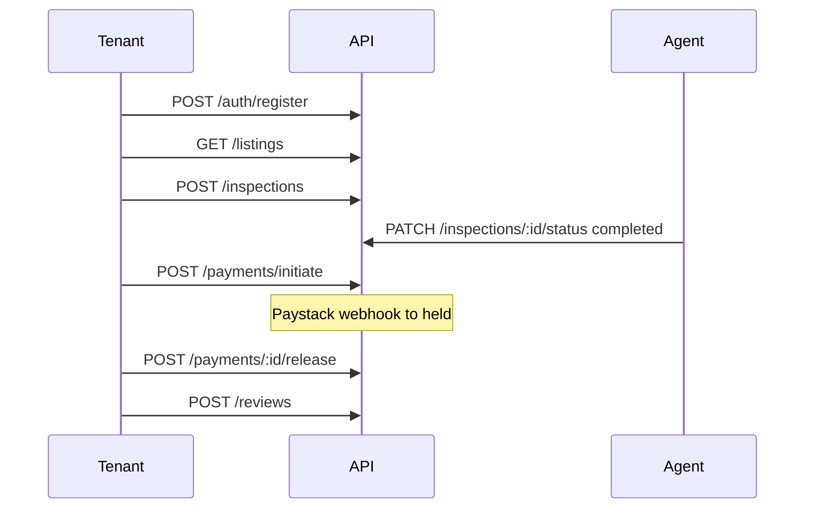

# RentWise API — Technical Guide

Companion to interactive Swagger at `GET /api/v1/docs` (development only). This document covers **integration patterns**, **use cases**, **dos and don'ts**, and **request/response DTO shapes** for every implemented endpoint.

**Base URL:** `{APP_URL}/api/v1` (local default: `http://localhost:3000/api/v1`)

---

## Table of contents

1. [Introduction and conventions](#1-introduction-and-conventions)
2. [Authentication and authorization](#2-authentication-and-authorization)
3. [Response and error envelopes](#3-response-and-error-envelopes)
4. [Integration patterns (dos and don'ts)](#4-integration-patterns-dos-and-donts)
5. [Domain use cases and flows](#5-domain-use-cases-and-flows)
6. [Platform endpoints](#6-platform-endpoints)
7. [Module reference](#7-module-reference)
8. [Webhooks and special cases](#8-webhooks-and-special-cases)
9. [Glossary and status enums](#9-glossary-and-status-enums)
10. [DTO appendix](#10-dto-appendix)
11. [Maintenance](#11-maintenance)

---

## 1. Introduction and conventions

| Topic | Convention |
| --- | --- |
| **Health** | `GET /health` — outside `/api/v1`; uses same JSON envelope |
| **Versioning** | All business routes under `/api/v1` |
| **Content-Type** | `application/json` for normal requests; Paystack webhook uses raw JSON body |
| **IDs** | UUID v4 strings |
| **Money** | `rentAmount`, `amount` as decimal **strings** (e.g. `"700000.00"`) |
| **Dates** | ISO 8601 in JSON (`createdAt`, token expiry fields) |
| **Date-only** | `scheduledDate` as `YYYY-MM-DD` |
| **Time** | `scheduledTime` stored as `HH:MM:SS`; send `HH:MM` in book request (normalized server-side) |
| **Roles** | `tenant` \| `agent` \| `landlord` \| `admin` |
| **Tracing** | Optional `x-request-id` header; server generates one if omitted |
| **Rate limits** | Default window + stricter auth routes — see `.env.example` (`RATE_LIMIT_*`, `AUTH_RATE_LIMIT_*`) |

---

## 2. Authentication and authorization

### Bearer JWT

Send on protected routes:

```http
Authorization: Bearer <accessToken>
```

Obtain tokens from `POST /auth/register` (201) or `POST /auth/login` (200). Refresh with `POST /auth/refresh-token`.

| Route pattern | Auth |
| --- | --- |
| `/admin/*` | Bearer + `admin` role (entire router) |
| Listing create/update/delete | Bearer + `agent` or `landlord` |
| Inspection book | Bearer + `tenant` |
| Payment initiate/release | Bearer + `tenant` |
| Review create | Bearer + any authenticated user (service gates tenant) |
| Listings search, reviews by listing, locations, apartment-types | Public (no Bearer required) |
| Listing by ID | Public with optional Bearer (owners see own non-verified listings) |

### Token response shape

Returned in `data` on register/login/refresh:

| Field | Type | Notes |
| --- | --- | --- |
| `user` | `UserPublic` \| `null` | `null` on refresh when not re-loaded |
| `accessToken` | string | Short-lived (default 15m) |
| `refreshToken` | string | Store securely; send on logout/refresh |
| `accessExpiresAt` | string | ISO timestamp |
| `refreshExpiresAt` | string | ISO timestamp |

See [UserPublic](#userpublic) in the DTO appendix.

---

## 3. Response and error envelopes

All JSON responses use a top-level wrapper from `src/lib/response.ts`.

### Success (200 / 201)

```json
{
  "status": "success",
  "message": "success",
  "data": { }
}
```

`message` may be `"created"` on 201 routes.

### Error (4xx / 5xx)

```json
{
  "status": "error",
  "message": "human-readable reason",
  "data": null
}
```

### Validation error (422)

When Zod validation fails:

```json
{
  "status": "error",
  "message": "validation error",
  "data": {
    "fieldErrors": {
      "email": ["Invalid email"],
      "amount": ["amount must be a valid decimal"]
    }
  }
}
```

### Common HTTP codes

| Code | Meaning |
| --- | --- |
| 401 | Missing or invalid Bearer token |
| 403 | Authenticated but not allowed (role, ownership, KYC) |
| 404 | Resource not found (or hidden by scoping) |
| 409 | Conflict (duplicate, invalid state for action) |
| 422 | Validation or business rule failure |
| 503 | Optional integration not configured (Paystack, R2) |

### Envelope quirks

| Endpoint | `data` shape |
| --- | --- |
| Most resources | Single key: `{ user }`, `{ listing }`, `{ report }`, … |
| Listings search | `{ listings, pagination }` |
| Conversations list | `{ conversations }` |
| Messages list | `{ messages, pagination }` — both at `data` top level |
| Payment initiate | `{ payment, authorizationUrl }` |
| Auth logout | `data: null` |
| Audit logs (scoped or admin) | `{ auditLogs, pagination }` |
| DELETE listing | **204 No Content** — no JSON body (exception) |

---

## 4. Integration patterns (dos and don'ts)

### Do

- Parse `{ status, message, data }` before reading nested fields.
- Store `refreshToken` securely; refresh before `accessExpiresAt`.
- Use `GET /listings` for tenant browse; only **verified** listings appear in search.
- Presign uploads (`POST /media/presign`) before putting URLs in listing/KYC payloads.
- Book inspections only on verified listings; schedule at least `inspection_advance_booking_days` ahead (config).
- Complete inspection (`completed`) before `POST /payments/initiate`.
- Match payment `amount` exactly to listing `rentAmount`.
- Release payment (`held` → `released`) before `POST /reviews`.
- Pass both `listingId` and `paymentId` on review create.
- Paginate listings, messages, and audit logs with `page` + `limit`.

### Don't

- Don't call `POST /payments/webhook` from a client — Paystack server only.
- Don't assume WebSocket chat — REST history only.
- Don't rely on phone OTP SMS in production yet (email OTP via Resend works).
- Don't hardcode business caps — read `GET /admin/config` when building admin tools.
- Don't expect Paystack Transfer on release — escrow is DB state only ([OI-016](OPEN-ISSUES.md)).
- Don't bypass role checks in the client — server enforces all gates.

### Contributor patterns

Request flow: `routes → validate → controller → service → repo`. Throw `AppError` in services. Call `auditLogWrite` after successful mutations. See [CONTRIBUTING.md](../CONTRIBUTING.md).

---

## 5. Domain use cases and flows

### Tenant happy path (E2E)



Reference script: `scripts/smoke-e2e.sh`

### Tenant journey

1. Register / login → optional email verify
2. Browse `GET /listings` → `GET /listings/:id`
3. Start chat `POST /conversations` (verified listing; tenant account verified for start)
4. Book `POST /inspections`
5. Pay `POST /payments/initiate` → Paystack checkout → webhook → `POST /payments/:id/release`
6. Review `POST /reviews` → public `GET /reviews/listing/:id`
7. Report `POST /reports` if needed

### Agent / landlord journey

1. Register as `agent` or `landlord` → `POST /kyc` → admin approval
2. `POST /media/presign` → upload photos/docs to R2
3. `POST /listings` → await admin verification
4. `PATCH /inspections/:id/status` on owned listings (`confirmed` → `completed`)
5. `GET /payments/me` to see payments on owned listings

### Admin journey

1. `GET /admin/verification-queue/listings` → `PATCH .../:id`
2. `GET /admin/verification-queue/kyc` → `PATCH .../:id`
3. `GET /admin/reports` → `PATCH /admin/reports/:id/status`
4. `GET /admin/config` → `PATCH /admin/config/:key`
5. `GET /admin/audit-logs` for full history

---

## 6. Platform endpoints

### GET /health

**Auth:** None

**Success 200 — data**

| Field | Type |
| --- | --- |
| `status` | `"ok"` |

---

### GET /api/v1/locations

**Auth:** None

**Success 200 — data**

| Field | Type |
| --- | --- |
| `locations` | `Location[]` |

---

### GET /api/v1/apartment-types

**Auth:** None

**Success 200 — data**

| Field | Type |
| --- | --- |
| `apartmentTypes` | `ApartmentType[]` |

---

### POST /api/v1/media/presign

**Auth:** Bearer (any role)

**Use case:** Obtain a presigned PUT URL before creating listings or KYC with file URLs.

**Request body**

| Field | Type | Required | Notes |
| --- | --- | --- | --- |
| `filename` | string | yes | 1–255 chars |
| `contentType` | string | yes | MIME type |
| `purpose` | enum | yes | `listing_photo` \| `ownership_doc` \| `kyc_document` |

**Success 200 — data**

| Field | Type | Notes |
| --- | --- | --- |
| `uploadUrl` | string | PUT target (expires ~15 min) |
| `publicUrl` | string | Use this URL in listing/KYC payloads |
| `key` | string | Object key in bucket |
| `expiresIn` | number | Seconds |

**Errors:** 503 if R2 env vars unset

---

## 7. Module reference

### Auth — `/api/v1/auth`

#### POST /auth/register

**Auth:** None (rate-limited)

**Use case:** Create account and receive tokens immediately.

**Request body**

| Field | Type | Required | Notes |
| --- | --- | --- | --- |
| `role` | enum | yes | `tenant` \| `agent` \| `landlord` |
| `fullName` | string | yes | 2–255 |
| `email` | string | yes | Valid email |
| `phone` | string | yes | 7–32 chars |
| `password` | string | yes | 8–128 chars |

**Success 201 — data:** `{ user, accessToken, refreshToken, accessExpiresAt, refreshExpiresAt }`

**Errors:** 409 duplicate email/phone

---

#### POST /auth/login

**Request body:** `{ email, password }`

**Success 200 — data:** Same token shape as register.

**Errors:** 401 invalid credentials

---

#### POST /auth/logout

**Auth:** Bearer

**Request body:** `{ refreshToken }`

**Success 200:** `data: null`, `message: "logged out"`

---

#### POST /auth/refresh-token

**Request body:** `{ refreshToken }`

**Success 200 — data:** Token fields; `user` may be `null`.

---

#### POST /auth/verify-phone

**Auth:** Bearer

**Request body:** `{ code }` — 6-digit string

**Success 200 — data:** `{ user }`

---

#### POST /auth/verify-email

**Auth:** Bearer

**Request body:** `{ code }` — 6-digit string

**Success 200 — data:** `{ user }`

---

#### POST /auth/oauth/google

**Request body**

| Field | Type | Required |
| --- | --- | --- |
| `idToken` | string | yes |
| `role` | enum | no | For new users only |

**Success 200 — data:** Token shape (same as login).

---

### Users — `/api/v1/users`

#### GET /users/me

**Auth:** Bearer

**Success 200 — data:** `{ user: UserPublic }`

---

#### PATCH /users/me

**Auth:** Bearer

**Request body** (at least one field)

| Field | Type | Notes |
| --- | --- | --- |
| `fullName` | string | 2–255 |
| `phone` | string | 7–32 |

**Success 200 — data:** `{ user: UserPublic }`

---

### KYC — `/api/v1/kyc`

#### POST /kyc

**Auth:** Bearer (`agent` / `landlord` typically)

**Use case:** Submit identity documents for listing create gate.

**Request body**

| Field | Type | Required |
| --- | --- | --- |
| `documentType` | enum | yes — `nin` \| `bvn` \| `passport` \| `drivers_licence` |
| `documentNumber` | string | yes |
| `documentFrontUrl` | string (URL) | yes |
| `documentBackUrl` | string (URL) | no |
| `selfieUrl` | string (URL) | no |

**Success 201 — data:** `{ submission: KycSubmission }`

**Errors:** 409 if already `pending` or `approved`

---

#### GET /kyc/me

**Auth:** Bearer

**Success 200 — data:** `{ submission: KycSubmission \| null }`

---

### Listings — `/api/v1/listings`

#### GET /listings

**Auth:** None

**Query:** `city`, `state`, `apartmentTypeId`, `minRent`, `maxRent`, `page` (default 1), `limit` (default 20, max 50)

**Use case:** Tenant search — returns **verified** listings only.

**Success 200 — data:** `{ listings: ListingDetail[], pagination }`

---

#### GET /listings/:id

**Auth:** Optional Bearer

**Use case:** Detail view. Non-verified listings visible only to owner or admin.

**Success 200 — data:** `{ listing: ListingDetail }`

**Errors:** 404

---

#### POST /listings

**Auth:** Bearer + `agent` or `landlord`

**Request body**

| Field | Type | Required |
| --- | --- | --- |
| `locationId` | uuid | yes |
| `apartmentTypeId` | uuid | yes |
| `title` | string | yes |
| `description` | string | yes |
| `rentAmount` | decimal string | yes |
| `ownershipDocUrl` | URL | yes |
| `videoUrl` | URL | no |
| `photoUrls` | URL[] | yes, 1–10 |

**Success 201 — data:** `{ listing: ListingDetail }` — `verificationStatus: pending`

**Errors:** 403 KYC not approved; 409 agent listing cap; 404 location/type; 422 photo count

---

#### PATCH /listings/:id

**Auth:** Bearer + owner role

**Request body:** Partial of create fields (at least one)

**Success 200 — data:** `{ listing: ListingDetail }`

---

#### DELETE /listings/:id

**Auth:** Bearer + owner

**Success:** 204 No Content (no JSON envelope)

---

### Inspections — `/api/v1/inspections`

#### POST /inspections

**Auth:** Bearer (`tenant`)

**Request body**

| Field | Type | Required | Notes |
| --- | --- | --- | --- |
| `listingId` | uuid | yes | Listing must be verified |
| `scheduledDate` | date | yes | `YYYY-MM-DD`, ≥ advance booking days |
| `scheduledTime` | string | yes | `HH:MM` 24-hour |

**Success 201 — data:** `{ inspection: InspectionDetail }` — status `pending`

**Errors:** 404 listing; 409 active inspection exists; 422 date too soon

---

#### GET /inspections/:id

**Auth:** Bearer — tenant, listing owner, or admin

**Success 200 — data:** `{ inspection: InspectionDetail }`

---

#### GET /inspections/me

**Auth:** Bearer

**Success 200 — data:** `{ inspections: InspectionDetail[] }`

---

#### PATCH /inspections/:id/status

**Auth:** Bearer — **listing owner only**

**Request body:** `{ status: "confirmed" | "cancelled" | "completed" }`

**Transitions:** `pending` → `confirmed` \| `cancelled`; `confirmed` → `completed` \| `cancelled`

**Success 200 — data:** `{ inspection: InspectionDetail }`

**Errors:** 403 not owner; 422 invalid transition

---

### Payments — `/api/v1/payments`

#### POST /payments/initiate

**Auth:** Bearer (`tenant`)

**Use case:** Start Paystack checkout after inspection `completed`.

**Request body**

| Field | Type | Required |
| --- | --- | --- |
| `inspectionId` | uuid | yes |
| `amount` | decimal string | yes — must match listing `rentAmount` |

**Success 201 — data**

| Field | Type |
| --- | --- |
| `payment` | `PaymentDetail` |
| `authorizationUrl` | string — redirect tenant to Paystack |

**Errors:** 403 not inspection tenant; 404; 409 active payment; 422 inspection not completed / amount mismatch; **503** Paystack unset

---

#### POST /payments/:id/release

**Auth:** Bearer (`tenant` who paid)

**Use case:** Mark escrow released after satisfied tenancy (DB only; no Paystack payout).

**Success 200 — data:** `{ payment: PaymentDetail }` — status `released`

**Errors:** 422 if not `held`

---

#### GET /payments/:id

**Auth:** Bearer — tenant, listing owner, or admin

**Success 200 — data:** `{ payment: PaymentDetail }`

---

#### GET /payments/me

**Auth:** Bearer

**Success 200 — data:** `{ payments: PaymentDetail[] }` — tenant's payments + payments on listings user owns

---

#### POST /payments/webhook

See [Section 8](#8-webhooks-and-special-cases).

---

### Conversations — `/api/v1/conversations`

#### GET /conversations

**Auth:** Bearer

**Success 200 — data:** `{ conversations: Conversation[] }`

---

#### POST /conversations

**Auth:** Bearer

**Request body**

| Field | Type | Required |
| --- | --- | --- |
| `listingId` | uuid | yes |
| `participantId` | uuid | yes — typically listing `ownerId` |

**Success 201 — data:** `{ conversation }` when new; **200** `{ conversation }` when existing thread returned (idempotent).

**Errors:** 400 self-chat; 404 listing

---

#### GET /conversations/:id/messages

**Auth:** Bearer (participant)

**Query:** `page` (default 1), `limit` (default 20, max 50)

**Success 200 — data:** `{ messages: Message[], pagination: { page, limit } }`

---

#### POST /conversations/:id/messages

**Auth:** Bearer (participant)

**Request body:** `{ content: string }` — min 1 char

**Success 201 — data:** `{ message: Message }`

---

### Reports — `/api/v1/reports`

#### POST /reports

**Auth:** Bearer

**Request body**

| Field | Type | Required |
| --- | --- | --- |
| `targetType` | enum | `listing` \| `user` |
| `targetId` | uuid | yes |
| `reason` | string | min 10 chars |

**Success 201 — data:** `{ report: Report }`

**Errors:** 400 self-report; 404 target; 409 open duplicate

---

#### GET /reports/me

**Auth:** Bearer

**Success 200 — data:** `{ reports: Report[] }`

---

### Reviews — `/api/v1/reviews`

#### POST /reviews

**Auth:** Bearer (`tenant` who paid)

**Request body**

| Field | Type | Required |
| --- | --- | --- |
| `listingId` | uuid | yes |
| `paymentId` | uuid | yes |
| `rating` | int | 1–5 |
| `comment` | string | max 2000, optional |

**Gates:** payment `released`; `payment.tenantId === caller`; `listingId` matches payment; one review per `paymentId`.

**Success 201 — data:** `{ review: Review }`

**Errors:** 403, 404, 409 duplicate, 422 not released / listing mismatch

---

#### GET /reviews/listing/:id

**Auth:** None

**Success 200 — data:** `{ reviews: ListingReview[] }`

**Errors:** 404 listing

---

### Audit log — `/api/v1/audit-logs`

#### GET /audit-logs

**Auth:** Bearer (any role — results scoped)

**Query:** `entityType`, `entityId`, `action`, `from`, `to` (ISO datetime), `page`, `limit` (max 100)

**Scoping:**

| Role | Sees |
| --- | --- |
| `tenant` | `actorId = self` OR entity in tenant inspections/payments |
| `agent` / `landlord` | `actorId = self` OR entity in owned listings / related inspections / payments |
| `admin` | Same scoped rules here; use `/admin/audit-logs` for full history |

**Success 200 — data:** `{ auditLogs: AuditLogRow[], pagination: { page, limit, total } }`

---

### Admin — `/api/v1/admin`

All routes require Bearer + `admin` role.

#### GET /admin/verification-queue/listings

**Success 200 — data:** `{ queue: ListingQueueItem[] }` — pending verification listings with owner, photos, location

---

#### PATCH /admin/verification-queue/listings/:id

**Request body:** `{ status: "verified" | "limited" | "rejected", note?: string }`

**Success 200 — data:** `{ listing: ListingDetail }`

**Errors:** 409 if not `pending`

---

#### GET /admin/verification-queue/kyc

**Success 200 — data:** `{ queue: KycQueueItem[] }` — `documentNumber` omitted from queue items

---

#### PATCH /admin/verification-queue/kyc/:id

**Request body:** `{ status: "approved" | "rejected", rejectionReason?: string }` — reason required when rejecting

**Success 200 — data:** `{ submission: KycSubmission }`

---

#### GET /admin/reports

**Success 200 — data:** `{ queue: ReportQueueItem[] }` — open and under_review with reporter + target hint

---

#### PATCH /admin/reports/:id/status

**Request body:** `{ status: "under_review" | "resolved" | "dismissed", note?: string }`

**Transitions:** `open` → `under_review`; `under_review` → `resolved` \| `dismissed`

**Success 200 — data:** `{ report: Report }`

---

#### GET /admin/audit-logs

**Query:** Same as scoped audit log

**Success 200 — data:** `{ auditLogs, pagination }` — unscoped

---

#### GET /admin/config

**Success 200 — data:** `{ config: SystemConfigEntry[] }`

---

#### PATCH /admin/config/:key

**Request body:** `{ value: string }`

**Success 200 — data:** `{ config: SystemConfigEntry }`

**Errors:** 404 unknown key

---

## 8. Webhooks and special cases

### Paystack webhook

| | |
| --- | --- |
| **URL** | `POST /api/v1/payments/webhook` |
| **Auth** | HMAC — header `x-paystack-signature` (SHA-512 hex of **raw** body) |
| **Body** | Raw JSON bytes (route mounted before `express.json()`) |
| **Events** | `charge.success` → `held`; failure events → `failed` |
| **Response 200 — data** | e.g. `{ received: true, paymentId?, status? }` or `{ received: true, ignored: true }` |
| **Errors** | 401 invalid signature; 503 Paystack unset |

Integrators must **not** call this endpoint from mobile/web clients.

### 503 — optional integrations

| Feature | When |
| --- | --- |
| Payments initiate/webhook | `PAYSTACK_SECRET_KEY` or `PAYSTACK_WEBHOOK_SECRET` missing |
| Media presign | R2 env vars missing |

Message in `message` field explains missing configuration.

### DELETE listing

Returns **204** with empty body — not wrapped in `{ status, message, data }`.

---

## 9. Glossary and status enums

| Entity | Field | Values |
| --- | --- | --- |
| Listing | `verificationStatus` | `pending`, `verified`, `limited`, `rejected` |
| Listing | `availabilityStatus` | `available`, … (default `available`) |
| Inspection | `status` | `pending`, `confirmed`, `completed`, `cancelled` |
| Payment | `status` | `initiated`, `processing`, `held`, `released`, `failed`, `refunded` |
| KYC | `status` | `pending`, `approved`, `rejected` |
| Report | `status` | `open`, `under_review`, `resolved`, `dismissed` |

### Audit actions (written on mutations)

`listing.created`, `listing.updated`, `listing.deleted`, `listing.verification_changed`, `inspection.booked`, `inspection.status_changed`, `payment.initiated`, `payment.released`, `payment.status_changed`, `kyc.submitted`, `kyc.decision`, `report.status_changed`, `config.updated`

---

## 10. DTO appendix

### UserPublic

Omitted: `passwordHash`. Typical fields:

| Field | Type |
| --- | --- |
| `id` | uuid |
| `role` | string |
| `fullName` | string |
| `email` | string |
| `phone` | string |
| `phoneVerified` | boolean |
| `emailVerified` | boolean |
| `isActive` | boolean |
| `createdAt` | ISO string |
| `updatedAt` | ISO string |

### ListingDetail

| Field | Type |
| --- | --- |
| `id` | uuid |
| `ownerId` | uuid |
| `title` | string |
| `description` | string |
| `rentAmount` | decimal string |
| `verificationStatus` | enum |
| `availabilityStatus` | string |
| `ownershipDocUrl` | string |
| `videoUrl` | string \| null |
| `createdAt`, `updatedAt` | ISO |
| `location` | `{ id, state, city, area, latitude?, longitude? }` |
| `apartmentType` | `{ id, label }` |
| `photos` | `{ id, photoUrl, sortOrder }[]` |

### InspectionDetail

| Field | Type |
| --- | --- |
| `id` | uuid |
| `tenantId` | uuid |
| `listingId` | uuid |
| `scheduledDate` | string |
| `scheduledTime` | string |
| `status` | enum |
| `createdAt`, `updatedAt` | ISO |
| `tenant` | `{ id, fullName }` |
| `listing` | `{ id, title, ownerId, rentAmount }` |

### PaymentDetail

| Field | Type |
| --- | --- |
| `id` | uuid |
| `tenantId` | uuid |
| `listingId` | uuid |
| `inspectionId` | uuid |
| `amount` | decimal string |
| `paystackReference` | string |
| `status` | enum |
| `createdAt` | ISO |
| `releasedAt` | ISO \| null |
| `tenant` | `{ id, fullName, email }` |
| `listing` | `{ id, title, ownerId, rentAmount }` |
| `inspection` | `{ id, status }` |

### ListingReview

| Field | Type |
| --- | --- |
| `id` | uuid |
| `rating` | 1–5 |
| `comment` | string \| null |
| `createdAt` | ISO |
| `reviewer` | `{ id, fullName }` |

### KycSubmission

| Field | Type |
| --- | --- |
| `id` | uuid |
| `userId` | uuid |
| `documentType` | enum |
| `documentFrontUrl` | string |
| `documentBackUrl` | string \| null |
| `selfieUrl` | string \| null |
| `status` | enum |
| `rejectionReason` | string \| null |
| `reviewedBy` | uuid \| null |
| `reviewedAt` | ISO \| null |
| `submittedAt` | ISO |

### Conversation

| Field | Type |
| --- | --- |
| `id` | uuid |
| `listingId` | uuid |
| `participantOne` | uuid |
| `participantTwo` | uuid |
| `createdAt` | ISO |

### Message

| Field | Type |
| --- | --- |
| `id` | uuid |
| `conversationId` | uuid |
| `senderId` | uuid |
| `content` | string |
| `isRead` | boolean |
| `sentAt` | ISO |

### Report

| Field | Type |
| --- | --- |
| `id` | uuid |
| `reporterId` | uuid |
| `targetType` | `listing` \| `user` |
| `targetId` | uuid |
| `reason` | string |
| `status` | enum |
| `createdAt` | ISO |

### AuditLogRow

| Field | Type |
| --- | --- |
| `id` | uuid |
| `actorId` | uuid |
| `actorRole` | string |
| `action` | string |
| `entityType` | string |
| `entityId` | uuid |
| `beforeState` | object \| null |
| `afterState` | object |
| `ipAddress` | string \| null |
| `userAgent` | string \| null |
| `createdAt` | ISO |

### SystemConfigEntry

| Field | Type |
| --- | --- |
| `id` | uuid |
| `key` | string |
| `value` | string |
| `description` | string \| null |
| `updatedBy` | uuid |
| `updatedAt` | ISO |

### Pagination

| Field | Type |
| --- | --- |
| `page` | number |
| `limit` | number |
| `total` | number |
| `totalPages` | number | listings search only |

---

## 11. Maintenance

| Trigger | Action |
| --- | --- |
| Change to `*.schema.ts` | Update this guide request tables |
| Change controller `data` envelope | Update quirks table + endpoint section |
| New route shipped | Add Section 7 block; tick [MODULE-DEPENDENCIES.md](MODULE-DEPENDENCIES.md) |
| Swagger JSDoc only | Prefer syncing from code types first |

**Source of truth order:** Zod schema → repo/types → controller → this document → Swagger JSDoc.

**Out of scope (not documented as implemented):** WebSocket chat, phone SMS OTP, Paystack Transfer payout — see [MODULE-DEPENDENCIES.md](MODULE-DEPENDENCIES.md) Wave 5 remaining items.

**Smoke references:** `scripts/smoke-e2e.sh`, `scripts/smoke-payments.sh`, `scripts/smoke-reviews.sh`, `scripts/smoke-wave1-samuel.sh`.
