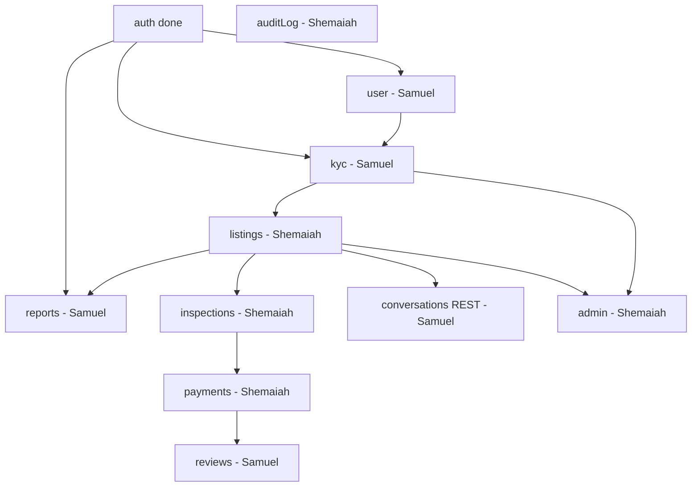

# RentWise Server — Shipping checklist

Top-to-bottom build order for the whole API. Designed so **Shemaiah** (technical / infra-heavy) and **Samuel** (smaller, pattern-friendly modules) can work **in parallel** with minimal overlap.

**How to use:** Check boxes in order within each wave. Do not start a wave until its **Depends on** row is satisfied. If blocked, ping the other person on the sync items listed at the bottom.

**Reference code:** `src/modules/auth/` (fully implemented). **How to code:** [CONTRIBUTING.md](../CONTRIBUTING.md).

---

## Ownership at a glance

| Owner | Modules & work |
| --- | --- |
| **Samuel** | `user`, `kyc`, `reports` → then `conversations` (REST only) → then `reviews` (after payments exist) |
| **Shemaiah** | Platform (schema, migrations, env, seeds), `listings`, `inspections`, `payments`, `admin`, `auditLog`, WebSocket chat (optional), auth upkeep |
| **Either** | Swagger touch-ups on routes you implement; module README updates |

Samuel should **not** run `pnpm generate`, change `src/db/schema/`, or edit `env.ts` without Shemaiah.

---

## Dependency graph



---

## Wave 0 — Done (no work unless fixing bugs)

| Done | Item | Owner |
| --- | --- | --- |
| [x] | Env validation (`src/config/env.ts`) | Shemaiah |
| [x] | Baseline DB migration applied | Shemaiah |
| [x] | Auth: register, login, logout, refresh | Shemaiah |
| [x] | Auth: verify phone / email OTP (Resend email) | Shemaiah |
| [x] | Auth: Google OAuth | Shemaiah |
| [x] | Health + Swagger + middleware stack | Shemaiah |

---

## Wave 1 — Parallel start (no listing data required yet)

**Depends on:** Wave 0 only.

### Samuel — `user` + `kyc` + `reports`

**Full implementation spec:** [WAVE-1-SAMUEL.md](WAVE-1-SAMUEL.md) (contracts, DB, logic, Swagger, gotchas, tests).

| Done | Task | Route / deliverable |
| --- | --- | --- |
| [x] | **user** — `GET /users/me` return safe profile (no password) | `GET /api/v1/users/me` |
| [x] | **user** — `PATCH /users/me` update name / phone rules | `PATCH /api/v1/users/me` |
| [x] | **user** — repo methods if moving off `authRepo` only | `user.repo.ts` |
| [x] | **kyc** — `POST /kyc` submit documents (URLs or placeholders until R2) | `POST /api/v1/kyc` |
| [x] | **kyc** — `GET /kyc/me` status + history | `GET /api/v1/kyc/me` |
| [x] | **kyc** — status log row on submit / resubmit | `kyc_status_logs` |
| [x] | **reports** — `POST /reports` polymorphic target (user or listing id) | `POST /api/v1/reports` |
| [x] | **reports** — `GET /reports/me` reporter’s own reports | `GET /api/v1/reports/me` |
| [x] | Update module READMEs for user, kyc, reports | `src/modules/*/README.md` |

### Shemaiah — platform + listings prep

| Done | Task | Deliverable |
| --- | --- | --- |
| [x] | Seed `locations` + `apartment_types` (script or SQL) | seed script / migration data |
| [x] | Seed `system_config` defaults from pitch | `system_config` rows |
| [x] | Shared helper: read `system_config` key | e.g. `src/lib/systemConfig.ts` |
| [x] | **listings** — `GET /listings` search + filter (public) | `GET /api/v1/listings` |
| [x] | **listings** — `GET /listings/:id` detail (public) | `GET /api/v1/listings/:id` |
| [x] | **listings** — `POST /listings` create (agent \| landlord), optional KYC gate | `POST /api/v1/listings` |
| [x] | **listings** — `PATCH` / `DELETE` owner-only + soft delete | `PATCH`, `DELETE /api/v1/listings/:id` |
| [x] | **listings** — photos + `listing_photos` | R2 presign + URL in create body |
| [x] | **listings** — verification status (admin logs on review) | `listing_verification_logs` |

**Wave 1 sync:** Samuel needs KYC **status values** agreed (`pending`, `approved`, etc.). Shemaiah exposes whether `kyc_required_for_listing` is enforced on create listing.

---

## Wave 2 — Listings live (Samuel unblocks on conversations)

**Depends on:** Wave 1 listings `GET /:id` working (Shemaiah).

### Samuel — `conversations` (REST only; no WebSocket yet)

| Done | Task | Route |
| --- | --- | --- |
| [x] | **conversations** — `POST /conversations` start thread for a listing | `POST /api/v1/conversations` |
| [x] | **conversations** — `GET /conversations` list for current user | `GET /api/v1/conversations` |
| [x] | **conversations** — `GET /conversations/:id/messages` paginated history | `GET /api/v1/conversations/:id/messages` |
| [x] | **conversations** — send message (REST MVP; WS deferred) | `POST /api/v1/conversations/:id/messages` |
| [x] | README: REST vs WebSocket split documented | `conversations/README.md` |

### Shemaiah — `inspections` + `admin` (listing/KYC queues)

| Done | Task | Route |
| --- | --- | --- |
| [x] | **inspections** — `POST /inspections` tenant books (listing exists, date rules) | `POST /api/v1/inspections` |
| [x] | **inspections** — `GET /inspections/:id` | `GET /api/v1/inspections/:id` |
| [x] | **inspections** — `GET /inspections/me` tenant + owner views | `GET /api/v1/inspections/me` |
| [x] | **inspections** — `PATCH /inspections/:id/status` confirm \| cancel | `PATCH /api/v1/inspections/:id/status` |
| [x] | **inspections** — `inspection_status_logs` on each transition | DB writes |
| [x] | **admin** — `GET /admin/verification-queue/listings` | admin route |
| [x] | **admin** — `PATCH /admin/verification-queue/listings/:id` verified \| limited \| rejected | admin route |
| [x] | **admin** — `GET /admin/verification-queue/kyc` | admin route |
| [x] | **admin** — `PATCH /admin/verification-queue/kyc/:id` approve \| reject | admin route |

**Wave 2 sync:** Samuel tests conversations against real `listing_id` from Shemaiah’s seed data.

---

## Wave 3 — Money path (Samuel waits; can polish Wave 1 modules)

**Depends on:** Inspection reachable in `completed` (or agreed) state.

### Shemaiah — `payments` + admin reports/config

| Done | Task | Route |
| --- | --- | --- |
| [x] | **payments** — `POST /payments/initiate` Paystack + `held` status | `POST /api/v1/payments/initiate` |
| [x] | **payments** — `POST /payments/webhook` HMAC verify | `POST /api/v1/payments/webhook` |
| [x] | **payments** — `POST /payments/:id/release` tenant release | `POST /api/v1/payments/:id/release` |
| [x] | **payments** — `GET /payments/:id`, `GET /payments/me` | GET routes |
| [x] | **payments** — `payment_status_logs` on transitions | DB writes |
| [x] | **admin** — `GET /admin/reports`, `PATCH /admin/reports/:id/status` | admin routes |
| [x] | **admin** — `GET /admin/config`, `PATCH /admin/config/:key` | admin routes |

### Samuel — optional hardening (parallel)

| Done | Task |
| --- | --- |
| [x] | Harden **user** / **kyc** / **reports** from Wave 1 QA |
| [x] | Extra validation edge cases + Swagger accuracy on your routes |

---

## Wave 4 — Reviews (Samuel)

**Depends on:** Shemaiah — payment in `released` (or agreed “completed”) state.

| Done | Task | Route |
| --- | --- | --- |
| [x] | **reviews** — `POST /reviews` gated on completed payment | `POST /api/v1/reviews` |
| [x] | **reviews** — `GET /reviews/listing/:id` public list | `GET /api/v1/reviews/listing/:id` |
| [x] | README: gating rule documented | `reviews/README.md` |

---

## Wave 5 — Cross-cutting & polish (mostly Shemaiah)

**Depends on:** Core modules above implemented enough to log real events.

| Done | Task | Owner |
| --- | --- | --- |
| [ ] | **auditLog** — `auditLogWrite()` helper | Shemaiah |
| [ ] | **auditLog** — `GET /audit-logs` scoped by role | Shemaiah |
| [ ] | **admin** — `GET /admin/audit-logs` unscoped | Shemaiah |
| [ ] | Wire audit calls into listings, inspections, payments, kyc, admin | Shemaiah |
| [ ] | **conversations** — WebSocket real-time (if MVP needs it) | Shemaiah |
| [ ] | Phone OTP — SMS provider (email already on Resend) | Shemaiah |
| [ ] | `pnpm run build` clean (fix skeleton TS errors) | Shemaiah |
| [ ] | E2E smoke: tenant path register → listing → inspect → pay → review | Both |

---

## Full API checklist (by module)

Use this as the single “everything we owe” list. Owner column: **S** = Samuel, **H** = Shemaiah.

### Auth (H — done)

| Done | Method | Path | Owner |
| --- | --- | --- | --- |
| [x] | POST | `/auth/register` | H |
| [x] | POST | `/auth/login` | H |
| [x] | POST | `/auth/logout` | H |
| [x] | POST | `/auth/refresh-token` | H |
| [x] | POST | `/auth/verify-phone` | H |
| [x] | POST | `/auth/verify-email` | H |
| [x] | POST | `/auth/oauth/google` | H |

### Users (S)

| Done | Method | Path | Owner |
| --- | --- | --- | --- |
| [x] | GET | `/users/me` | S |
| [x] | PATCH | `/users/me` | S |

### KYC (S)

| Done | Method | Path | Owner |
| --- | --- | --- | --- |
| [x] | POST | `/kyc` | S |
| [x] | GET | `/kyc/me` | S |

### Listings (H)

| Done | Method | Path | Owner |
| --- | --- | --- | --- |
| [x] | GET | `/listings` | H |
| [x] | GET | `/listings/:id` | H |
| [x] | POST | `/listings` | H |
| [x] | PATCH | `/listings/:id` | H |
| [x] | DELETE | `/listings/:id` | H |

### Inspections (H)

| Done | Method | Path | Owner |
| --- | --- | --- | --- |
| [x] | POST | `/inspections` | H |
| [x] | GET | `/inspections/:id` | H |
| [x] | GET | `/inspections/me` | H |
| [x] | PATCH | `/inspections/:id/status` | H |

### Payments (H)

| Done | Method | Path | Owner |
| --- | --- | --- | --- |
| [x] | POST | `/payments/initiate` | H |
| [x] | POST | `/payments/webhook` | H |
| [x] | POST | `/payments/:id/release` | H |
| [x] | GET | `/payments/:id` | H |
| [x] | GET | `/payments/me` | H |

### Conversations (S — REST; H — WebSocket)

| Done | Method | Path | Owner |
| --- | --- | --- | --- |
| [x] | GET | `/conversations` | S |
| [x] | POST | `/conversations` | S |
| [x] | GET | `/conversations/:id/messages` | S |
| [x] | POST | `/conversations/:id/messages` | S |
| [ ] | WS | real-time delivery | H |

### Reports (S)

| Done | Method | Path | Owner |
| --- | --- | --- | --- |
| [x] | POST | `/reports` | S |
| [x] | GET | `/reports/me` | S |

### Reviews (S — after payments)

| Done | Method | Path | Owner |
| --- | --- | --- | --- |
| [x] | POST | `/reviews` | S |
| [x] | GET | `/reviews/listing/:id` | S |

### Audit log (H)

| Done | Method | Path | Owner |
| --- | --- | --- | --- |
| [ ] | GET | `/audit-logs` | H |

### Admin (H)

| Done | Method | Path | Owner |
| --- | --- | --- | --- |
| [x] | GET | `/admin/verification-queue/listings` | H |
| [x] | PATCH | `/admin/verification-queue/listings/:id` | H |
| [x] | GET | `/admin/verification-queue/kyc` | H |
| [x] | PATCH | `/admin/verification-queue/kyc/:id` | H |
| [x] | GET | `/admin/reports` | H |
| [x] | PATCH | `/admin/reports/:id/status` | H |
| [ ] | GET | `/admin/audit-logs` | H |
| [x] | GET | `/admin/config` | H |
| [x] | PATCH | `/admin/config/:key` | H |

---

## Parallel timeline (calendar view)

```text
Week / sprint slice          Shemaiah                          Samuel
─────────────────────────────────────────────────────────────────────────
Start                        seeds, listings CRUD/search       user, kyc, reports
Listings GET stable          inspections, admin queues         conversations REST
Inspections done             payments + Paystack               polish user/kyc/reports
Payments released            auditLog, admin config, WS?         reviews
Ship                         E2E smoke + build green           Swagger on own routes
```

---

## Coordination — do together, not alone

| Topic | Who leads |
| --- | --- |
| `src/db/schema/` changes + `pnpm generate` / `migrate` | Shemaiah |
| New env vars (`env.ts`, `.env.example`) | Shemaiah notifies Samuel |
| KYC approved enum + listing create gate | Align before Samuel finishes kyc / H ships POST listings |
| Payment status allowed for reviews | H documents; S starts reviews after |
| Shared `.env` updates | Shemaiah notifies Samuel |

---

## External services

| Service | Modules | Owner |
| --- | --- | --- |
| Neon Postgres | all | H (migrations) |
| Resend | auth email OTP | H (done) |
| Google OAuth | auth | H (done) |
| Paystack | payments | H |
| Cloudflare R2 | listings photos, maybe kyc docs | H (Samuel can use URL string MVP first) |
| SMS | auth phone OTP | H |
| Sentry | all | either |

---

## Module README index

| Module | README | Primary owner |
| --- | --- | --- |
| auth | `src/modules/auth/README.md` | H |
| user | `src/modules/user/README.md` | S |
| kyc | `src/modules/kyc/README.md` | S |
| listings | `src/modules/listings/README.md` | H |
| inspections | `src/modules/inspections/README.md` | H |
| payments | `src/modules/payments/README.md` | H |
| conversations | `src/modules/conversations/README.md` | S (REST), H (WS) |
| reviews | `src/modules/reviews/README.md` | S |
| reports | `src/modules/reports/README.md` | S |
| auditLog | `src/modules/auditLog/README.md` | H |
| admin | `src/modules/admin/README.md` | H |

---

## When to update this doc

- A route is shipped → check the box in PR description or here.
- Ownership changes.
- MVP scope cut → strike items and note in PR.
